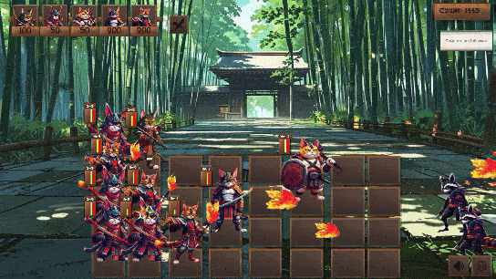

# 🐱 Cat samurai

## Plants vs Zombies-like Game

A tower defense game inspired by Plants vs Zombies, fully developed from scratch over 2 months.

### Core Stack:

- Unity 6 (Built-in render, UI based game)

- Addressables for dynamic asset loading

- ScriptableObjects for game data

- Event-driven architecture

- YG SDK plugin for Yandex Game Platform integration

### Key Features:

- 6 combat units (3 upgrade tiers each = 18 unique variations)

- 3 enemy archetypes (Default (balanced) / Fast (low HP) / Tank (armored)

- 10 story levels with between-level narrative via animated text boxes

- Mobile-friendly UI (UGUI + touch controls)

 [[Yandex Games link](https://yandex.ru/games/app/427803?lang=ru)]

